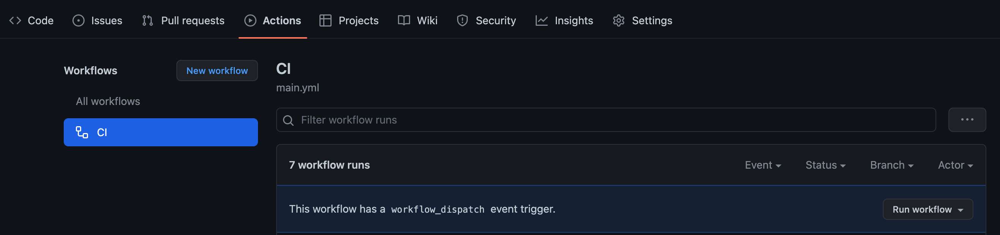

## Introduction

This branescript is created for the data processing pipeline for the kaggle data science project [Titanic Kaggle competition](https://www.kaggle.com/c/titanic) using the [Brane](https://github.com/epi-project/brane) framework.

This script makes use of two separate packages:  
- [brane_compute](https://github.com/web-services-and-cloud-based-systems/brane-compute-package)
- [brane_visualize](https://github.com/web-services-and-cloud-based-systems/brane-visualise-package)

This scripts runs on a brane instance as defined [here](https://wiki.enablingpersonalizedinterventions.nl/user-guide/system-engineers/introduction.html).

To understand the function calls in the script, read the readme for the [brane_compute](https://github.com/web-services-and-cloud-based-systems/brane-compute-package) and [brane_visualize](https://github.com/web-services-and-cloud-based-systems/brane-visualise-package) packages.

## Automated running of branescript (DSl)
We have set automated build for this brane script using github actions. The following happens -   
1. Imports both compute and visualize packages from their github repositories and builds it
2. Runs the workflow for the titanic challenge as described in titanic_workflow.bs

The triggers are `push` and `pull_request`, but, one can run it manually as well. Please refer to the image below to see how. (Click on run workflow(CI))

## Running this branescript in local/K8
We assume that you have brane cli (installed) and brane (installed and deployed). Now run the following commands in sequence -  
1. `brane import web-services-and-cloud-based-systems/brane-compute-package`
2. `brane import web-services-and-cloud-based-systems/brane-visualise-package`
3. `brane run titanic_workflow.bs --data /data`

